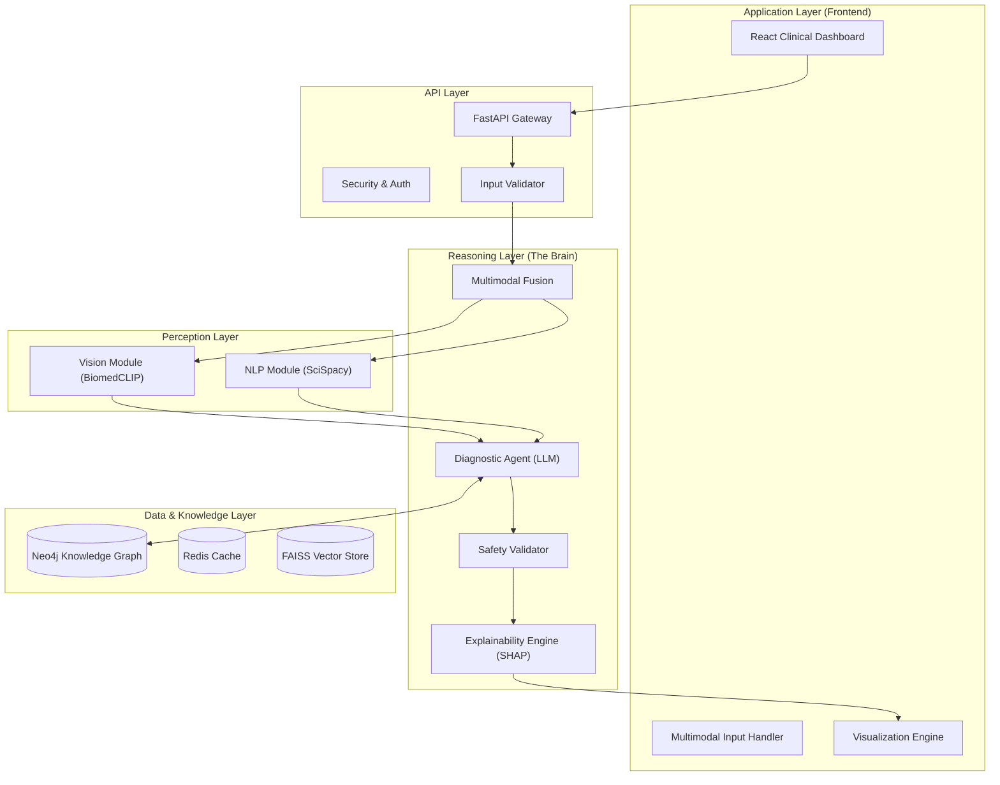

# VerdictMed AI 🏥

[](https://www.python.org/)
[](https://reactjs.org/)
[](https://fastapi.tiangolo.com/)
[](https://neo4j.com/)
[](LICENSE)
[](tests/)
[]()

> **"Bridging the gap between raw clinical data and actionable life-saving insights."**

**VerdictMed AI** is a production-grade Clinical Decision Support System (CDSS) engineered to reduce diagnostic error and physician burnout. Unlike standard black-box AI models, VerdictMed employs a **Neuro-Symbolic architecture**—fusing the generative flexibility of LLMs with the factual rigidity of Knowledge Graphs (GraphRAG)—to provide transparent, evidence-backed diagnostic recommendations.

---

## 📊 Project Status

### ✅ Completed & Production-Ready
- [x] **Core Architecture**: 5-layer modular design fully implemented
- [x] **Multimodal Input Processing**: DICOM/X-ray, Clinical Text, Lab Values
- [x] **Vision Analysis**: BiomedCLIP integration for medical image classification
- [x] **NLP Pipeline**: Clinical entity extraction with SciSpacy
- [x] **Knowledge Graph**: Neo4j integration with fallback to mock service
- [x] **Explainability Engine**: SHAP-based feature importance + reasoning chains
- [x] **Safety Validation**: Confidence thresholds, critical alerts, human-in-loop
- [x] **API Layer**: FastAPI with async support, Swagger documentation
- [x] **Clinical Dashboard**: 3-column React interface with real-time updates
- [x] **Testing Infrastructure**: 83+ automated tests (~75% coverage)
- [x] **Containerization**: Docker Compose orchestration
- [x] **Monitoring & Alerts**: Prometheus alert rules with 6 critical alerts
- [x] **Incident Response**: Comprehensive runbooks for P1/P2/P3 incidents
- [x] **CI/CD Pipeline**: Automated testing + canary deployment strategy
- [x] **Multi-Modal Fusion**: Inline fusion with documented strategy
- [x] **LangGraph State**: TypedDict definitions for type-safe workflows

### 🚧 In Active Development
- [ ] **UMLS Integration**: Full medical ontology import into Neo4j
- [ ] **GradCAM Heatmaps**: Visual X-ray explanations (module exists, UI integration pending)
- [ ] **FHIR Support**: HL7 FHIR interoperability for EHR systems
- [ ] **Advanced Caching**: Redis optimization for production scale
- [ ] **MedSAM Segmentation**: Precise anatomical region masking
- [ ] **500+ Case Evaluation**: Comprehensive accuracy validation (target: >85%)

### 🔮 Planned Future Enhancements
- [ ] Voice-to-Chart dictation support
- [ ] Multi-language clinical note processing
- [ ] Federated learning for privacy-preserving model updates
- [ ] Mobile-responsive dashboard

> **Current Version**: MVP - Production-Ready with Complete Monitoring & CI/CD

---

## 🏛️ System Architecture

The system is built on a scalable **5-Layer Architecture**, ensuring clear separation of concerns between perception, reasoning, and data persistence.



---

## 💡 Why VerdictMed?

### 1. Neuro-Symbolic Logic (GraphRAG)
Large Language Models represent probability, but medicine requires accuracy. VerdictMed anchors every LLM prediction against a deterministic **Neo4j Knowledge Graph**. This "Graph Retrieval-Augmented Generation" (GraphRAG) pattern drastically reduces hallucinations by validating generated diagnoses against verified medical ontologies.

### 2. True Multimodal Fusion
Diagnostic truth rarely lies in a single modality. VerdictMed treats disparate data streams—**DICOM imaging**, **clinical narratives**, and **structured lab values**—as first-class citizens. Our fusion layer synthesizes these inputs into a cohesive patient context vector before reasoning begins.

### 3. Glass-Box Explainability
A "black box" has no place in a hospital. We implement a multi-faceted explainability engine:
- **SHAP (SHapley Additive exPlanations)**: Quantifies the exact contribution of each symptom to the final diagnosis.
- **Reasoning Chains**: Exposes the step-by-step logical deduction path (e.g., *Step 1: Detected consolidation -> Step 2: Correlated with fever -> Step 3: Rules out Heart Failure*).
- **GradCAM**: Generates heatmaps for X-ray analysis, highlighting the exact pixels driving the AI's decision.

### 4. Deterministic Safety Layers
While the reasoning engine is probabilistic, safety is binary. A dedicated **Safety Validator** enforces rigid protocols:
- **Critical Alerts**: Immediate flagging of high-mortality conditions (Sepsis, MI, Stroke).
- **Confidence Floors**: Automatic referral for any prediction under 55% confidence.
- **Human-in-the-Loop**: The system is designed to *augment*, not replace, the physician, requiring manual sign-off on all high-stakes outputs.

---

## 🛠️ Tech Stack & Engineering

| Component | Technology | Engineering Highlights |
|-----------|------------|------------------------|
| **Frontend** | React 18, Tailwind | 3-Column "Cockpit" Dashboard, Real-time status updates |
| **Backend** | FastAPI (Python 3.9) | Async request handling, Pydantic type safety, Swagger docs |
| **Vision** | BiomedCLIP, PyTorch | Zero-shot classification, DICOM handling via `pydicom` |
| **NLP** | SciSpacy | Named Entity Recognition (NER) for medical terminology |
| **Knowledge** | Neo4j (Cypher) | Graph database for modeling disease-symptom relationships via graph algorithms |
| **Explainability** | SHAP, Custom Logic | Feature importance calculation, Logic trace generation |
| **Infrastructure** | Docker Compose | One-command orchestration of 5+ services (API, DB, UI, Cache) |

---

## ⚡ Getting Started

### The Fast Lane: Docker (Recommended)
Launch the entire production stack in under 2 minutes.

```bash
# 1. Clone the repository
git clone https://github.com/HemantSudarshan/VerdictMed-AI.git
cd VerdictMed-AI

# 2. Launch services
docker-compose up --build
```
> **Access:**
> - **Dashboard:** [http://localhost:3000](http://localhost:3000)
> - **API Docs:** [http://localhost:8000/docs](http://localhost:8000/docs)

### The Builder's Path: Local Development

<details>
<summary><strong>Backend Setup (Python)</strong></summary>

```bash
# Create & activate environment
python -m venv venv
source venv/bin/activate  # Windows: venv\Scripts\activate

# Install dependencies
pip install -r requirements.txt

# Run API server
python -m uvicorn src.api.main:app --reload
```
</details>

<details>
<summary><strong>Frontend Setup (Node.js)</strong></summary>

```bash
cd frontend
npm install
npm run dev
```
</details>

---

## 🧪 Testing & Verification

We adhere to rigorous testing standards suited for medical software. The repository includes a comprehensive suite of **83+ automated tests**.

```bash
# Run the full regression suite
python -m pytest tests/

# Run PRD-specific test cases
python -m pytest tests/unit/test_reasoning_agent.py::TestPRDRequirements -v

# Key test modules:
# - tests/unit/test_vision.py              (Image processing & BiomedCLIP)
# - tests/unit/test_neo4j_service.py       (Graph database integration)
# - tests/unit/test_shap_explainer.py      (Explainability logic)
# - tests/unit/test_reasoning_agent.py     (PRD diagnostic requirements)
# - tests/integration/test_pipeline.py     (End-to-end diagnostic flow)
```

**Coverage:** ~75% across core modules.

### PRD-Validated Test Cases
The system includes specific tests validating PRD Stage 9.2 requirements:
- ✅ **Pneumonia Detection**: Classic symptom recognition (fever + cough + dyspnea)
- ✅ **Low Confidence Escalation**: Vague symptoms trigger human review
- ✅ **Critical Condition Alerts**: MI symptoms flagged as critical
- ✅ **Negation Handling**: Denied symptoms correctly excluded from reasoning

---

## 📸 Interface Preview

**(Dashboard Screenshot)**
Will be updated after final UI/UX testing, intiatl UI needs to be more resposive

---

## 📊 Monitoring & Operations

### Prometheus Alerts
Production monitoring with 6 critical alerts:
- **AccuracyDropped**: Model accuracy < 85% (Critical)
- **HighLatency**: P95 latency > 5 seconds (Warning)
- **EscalationRateHigh**: > 30% escalation rate (Warning)
- **FalseNegativeSpike**: > 5 false negatives/hour (Critical)
- **ServiceDown**: API unavailable (Critical)
- **LowDailyVolume**: < 100 diagnoses/day (Info)

See [`monitoring/alerts/cdss_alerts.yml`](monitoring/alerts/cdss_alerts.yml) for full configuration.

### Incident Response
Comprehensive runbooks available in [`docs/runbooks/incident-response.md`](docs/runbooks/incident-response.md):
- **P1 (< 15 min)**: Service down, false negatives
- **P2 (< 1 hour)**: Accuracy drop, high latency
- **P3 (< 4 hours)**: Elevated escalations, drift

---

## 🚀 CI/CD Pipeline

### Continuous Integration
Automated testing on every commit:
- Linting (Ruff) + Type checking (MyPy)
- Unit & integration tests
- Security scanning (Trivy)
- Docker image build

### Continuous Deployment
**Staging** (on `develop` branch):
- Automatic deployment to staging cluster
- Smoke tests (health + diagnosis endpoints)

**Production** (on `main` branch):
1. **Canary Deployment**: 5% traffic to new version
2. **Monitoring**: 5-minute observation period
3. **Validation**: Check accuracy > 85%, error rate < 5%
4. **Decision**: Auto-rollback on failure OR full rollout

See [`.github/workflows/ci.yml`](.github/workflows/ci.yml) for pipeline details.

---

## 🔮 Roadmap

- [ ] **500+ Case Evaluation**: Document comprehensive accuracy validation
- [ ] **MedSAM Integration**: Implementing the Segment Anything Model for precise anatomical masking
- [ ] **FHIR Interoperability**: Standardizing data exchange with Electronic Health Records (EHR)
- [ ] **Voice-to-Chart**: Automatic transcription of clinician dictations into structured inputs
- [ ] **Full LangGraph Migration**: Move from SimpleDiagnosticAgent to graph-based workflow

---

## 👨‍⚕️ Medical Disclaimer

**VerdictMed AI is a prototype CDSS for research and demonstration purposes.**
It is **not** FDA-cleared for clinical use. All outputs must be verified by a licensed medical professional. The system is designed to act as a "second set of eyes," not a replacement for clinical judgment.

---

## 📄 License

MIT License © 2026 VerdictMed AI Team. See [LICENSE](LICENSE) for details.
